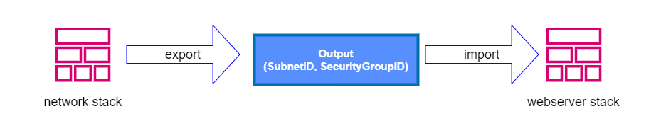

# cloudformation-cross-stack-reference

CloudFormation Cross Stack Reference

- Step1 - Deploy a sample network configuration stack with the network template provided. For stackname use: SampleNetworkCrossStack.

- Step2 - Deploy a new stack that will setup a Linux EC2 instance (Web server) and reference the sample network stack previously created.

- Diagram:
